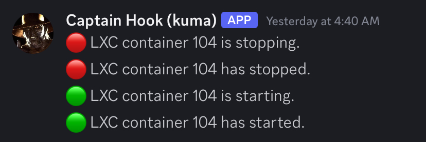

# lxc-status-checks

These scripts will examine the status of LXC containers and notify a Discord webhook when they're not running or in the process of starting/stopping. This is done with a cron job and hookscript.

## Cron


The cron job (`lxcstatus.sh`) uses `pct status` to get the status of each container. If the container is stopped, it will send a notification to its webhook. I have separate channels/webhooks for each of my containers. You should add your webhooks to the `container_webhooks` array.

```bash
declare -A container_webhooks
# Container 1
container_webhooks[100]="https://discordapp.com/api/webhooks/WEBHOOK_KEY_FOR_CONTAINER_1"
# Container 2
container_webhooks[101]="https://discordapp.com/api/webhooks/WEBHOOK_KEY_FOR_CONTAINER_2"
# Container 3
container_webhooks[102]="https://discordapp.com/api/webhooks/WEBHOOK_KEY_FOR_CONTAINER_3"
# Container 4
container_webhooks[103]="https://discordapp.com/api/webhooks/WEBHOOK_KEY_FOR_CONTAINER_4"
# Container 5
container_webhooks[104]="https://discordapp.com/api/webhooks/WEBHOOK_KEY_FOR_CONTAINER_1"
```

If you prefer, you could use a single webhook. I put my script in `/usr/local/bin` and set it to run every 5 minutes.

```bash
*/5 * * * * /usr/local/bin/lxcstatus.sh >> /var/log/lxcstatus.log 2>&1
```

The output will go to `/var/log`, so I set up a `logrotate` job to cycle out these files.

```bash
sudo nano /etc/logrotate.d/lxcstatus
```

```bash
/var/log/lxcstatus.log {
    daily
    rotate 7
    missingok
    notifempty
    compress
    delaycompress
    copytruncate
    create 644 root root
}
```

This rotates the logs daily and keeps them for 7 days.

# Hook

The hook script (`statushook.sh`) runs whenever a container event occurs. It gets the event type and sends a notification if the container is starting or stopping. You have to add this to a snippets folder inside a Proxmox storage volume.

```bash
sudo mkdir /var/lib/vz/snippets
sudo cp /path/to/statushook.sh /var/lib/vz/snippets/statushook.sh
sudo chmod +x /var/lib/vz/snippets/statushook.sh
sudo pct set 100 --hookscript local:snippets/statushook.sh
```

You can test this by starting and stopping the container to confirm the notifications are being sent.

```bash
sudo pct stop 100
sudo pct start 100
```



You'll want to set up a `logrotate` job for `lxchook.log` as well.

```bash
/var/log/lxchook.log {
    weekly
    rotate 4
    missingok
    notifempty
    compress
    delaycompress
    copytruncate
    create 644 root root
}
```

This will rotate logs weekly and store them for 4 weeks.